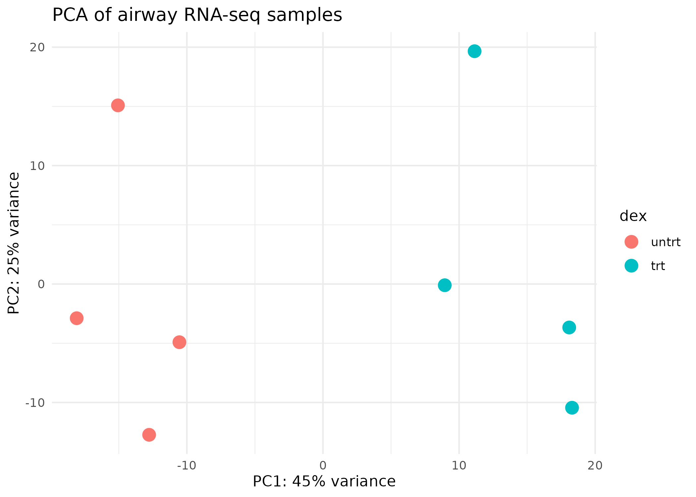
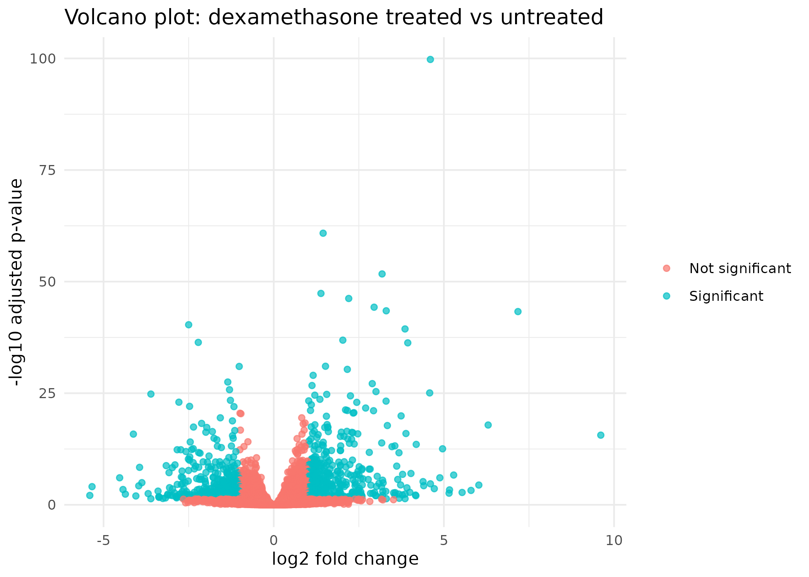
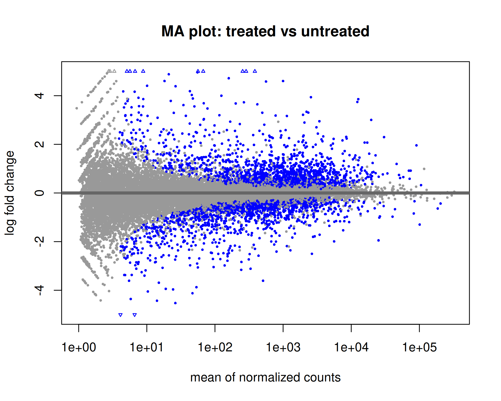
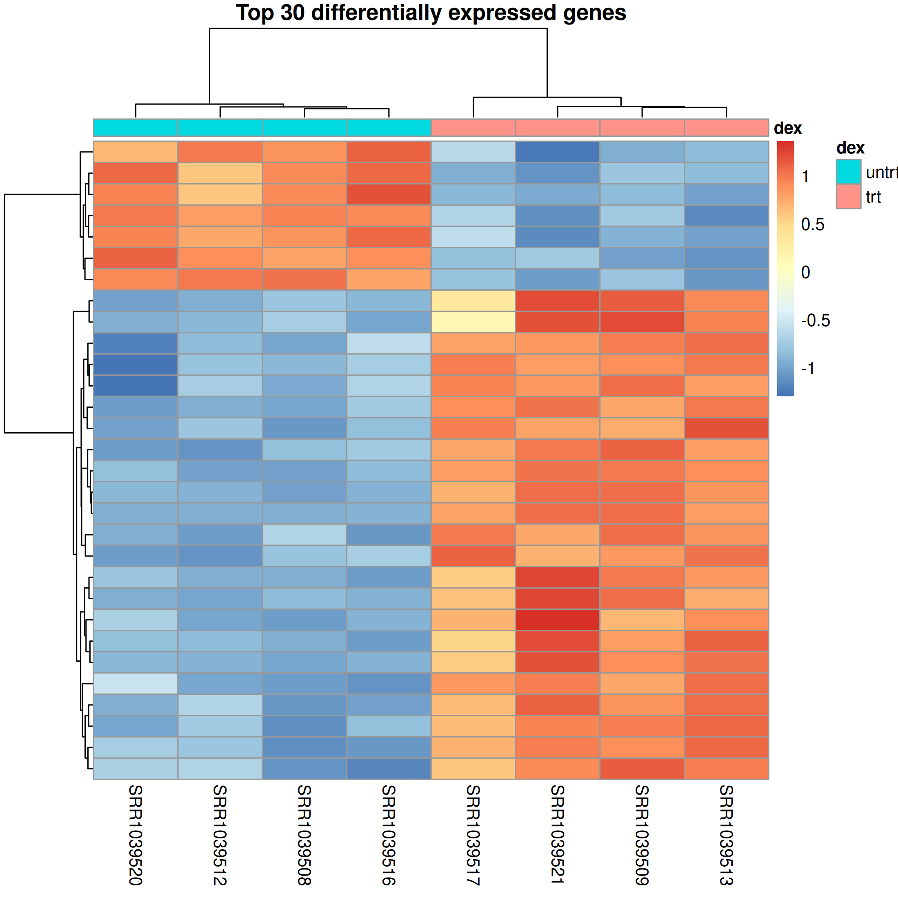

# RNA-seq Differential Expression Workflow with DESeq2


## Project overview

This repository demonstrates a reproducible RNA-seq differential expression workflow using R and DESeq2.

The project analyses gene-level RNA-seq count data from the Bioconductor `airway` dataset, comparing dexamethasone-treated and untreated human airway smooth muscle cells.

This project demonstrates core transcriptomics skills, including count matrix handling, metadata inspection, differential expression analysis, visualisation, and biological interpretation.

## Headline result

The DESeq2 workflow tested **22,369 genes** and identified **2,694 genes** as significantly differentially expressed at adjusted p-value `< 0.05`.

## Aim

To identify differentially expressed genes between dexamethasone-treated and untreated airway smooth muscle cell samples using a standard RNA-seq differential expression workflow.

## Workflow

```text
RNA-seq count data
        ↓
Sample metadata inspection
        ↓
DESeq2 dataset construction
        ↓
Normalisation and differential expression testing
        ↓
PCA / MA plot / volcano plot / heatmap
        ↓
Biological interpretation
```

## Example outputs

### PCA plot



### Volcano plot



### MA plot



### Heatmap of top differentially expressed genes



## Repository structure

```text
rnaseq-deseq2-workflow/
├── data/
│   └── processed/
├── scripts/
│   ├── 01_load_airway_data.R
│   ├── 02_deseq2_analysis.R
│   └── 03_visualisation.R
├── figures/
├── results/
│   └── tables/
├── docs/
│   ├── PROJECT_PLAN.md
│   └── METHODS.md
├── environment.yml
└── README.md
```

## Data

The workflow uses the Bioconductor `airway` dataset.

The first script loads the dataset directly in R and exports processed analysis files.

Generated processed files include:

| File                                          | Description                           |
| --------------------------------------------- | ------------------------------------- |
| `data/processed/airway_counts.csv`            | Raw gene count matrix                 |
| `data/processed/airway_metadata.csv`          | Sample metadata                       |
| `data/processed/airway_normalised_counts.csv` | DESeq2-normalised counts              |
| `data/processed/airway_vst_counts.csv`        | Variance-stabilised expression matrix |
| `data/processed/deseq2_dds.rds`               | Saved DESeq2 dataset object           |

## How to run the workflow

Run the scripts from the repository root:

```bash
Rscript scripts/01_load_airway_data.R
Rscript scripts/02_deseq2_analysis.R
Rscript scripts/03_visualisation.R
```

## Generated outputs

### Results tables

| Output                                                   | Description                                     |
| -------------------------------------------------------- | ----------------------------------------------- |
| `results/tables/airway_dataset_summary.csv`              | Summary of genes, samples, and treatment groups |
| `results/tables/deseq2_results_treated_vs_untreated.csv` | Full DESeq2 results table                       |

### Figures

| Output                           | Description                                          |
| -------------------------------- | ---------------------------------------------------- |
| `figures/pca_plot.png`           | PCA plot of RNA-seq samples                          |
| `figures/ma_plot.png`            | MA plot of DESeq2 results                            |
| `figures/volcano_plot.png`       | Volcano plot of differential expression results      |
| `figures/top30_gene_heatmap.png` | Heatmap of the top 30 differentially expressed genes |

## Interpretation summary

The analysis shows a clear transcriptional response to dexamethasone treatment in human airway smooth muscle cells.

After low-count filtering, DESeq2 tested **22,369 genes** and identified **2,694 significantly differentially expressed genes** at adjusted p-value `< 0.05`. This suggests that dexamethasone treatment leads to broad gene expression changes, consistent with its role as a glucocorticoid affecting inflammatory, regulatory, and cellular signalling pathways.

The PCA plot provides an overview of sample-level variation and helps assess whether treated and untreated samples separate by expression profile. The MA plot and volcano plot show the relationship between expression level, fold change, and statistical significance, highlighting genes with the strongest treatment-associated changes. The heatmap of top differentially expressed genes provides a visual check of whether the most significant genes distinguish treated from untreated samples.

Overall, this workflow demonstrates how RNA-seq count data can be processed, statistically analysed, visualised, and interpreted using DESeq2. For a fuller interpretation of the results, figures, and limitations, see [`docs/INTERPRETATION.md`](docs/INTERPRETATION.md).


## Skills demonstrated

This project demonstrates:

* RNA-seq differential expression analysis
* DESeq2 workflow design
* count matrix and metadata handling
* data normalisation
* exploratory data visualisation
* statistical testing in R
* biological interpretation of gene expression results
* reproducible GitHub project organisation

## Notes on reproducibility

This is a count-level RNA-seq workflow rather than a raw FASTQ-to-counts pipeline.

The purpose of this repository is to demonstrate differential expression analysis, visualisation, and interpretation using processed gene-level RNA-seq counts. A future project can extend this portfolio with a full FASTQ-to-counts workflow using tools such as FastQC, STAR or HISAT2, featureCounts, and Snakemake.

## Project status

Version 1 complete: initial DESeq2 workflow, results tables, and figures generated.
